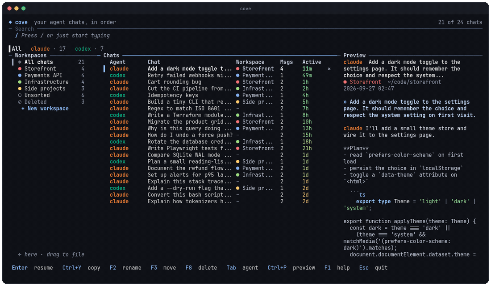
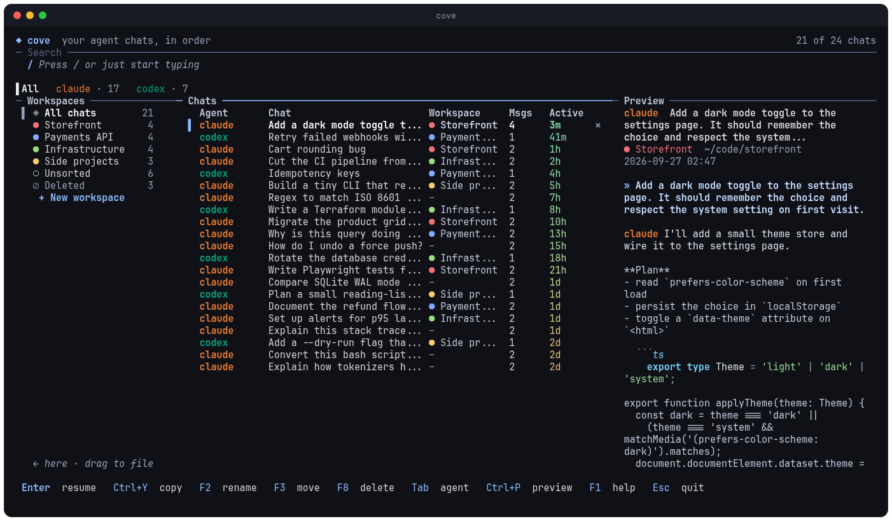
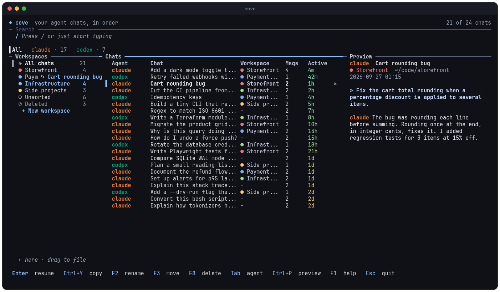
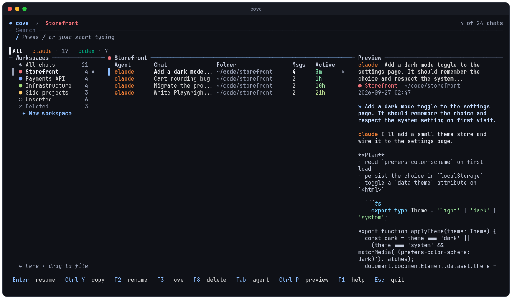
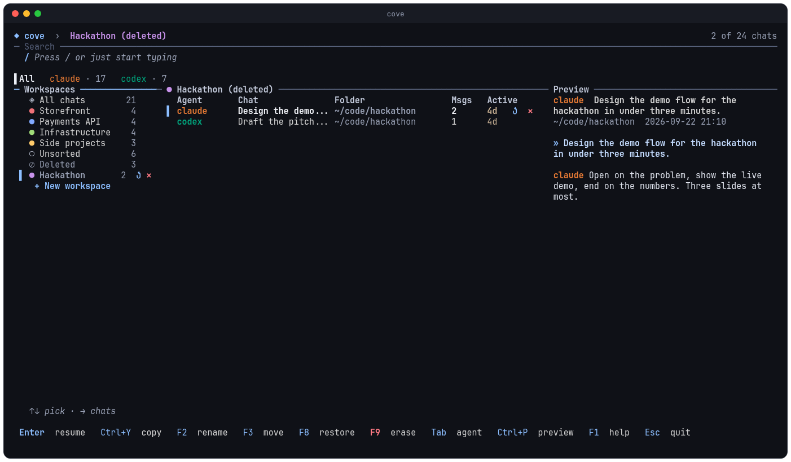
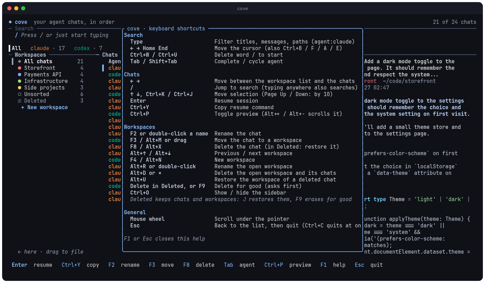
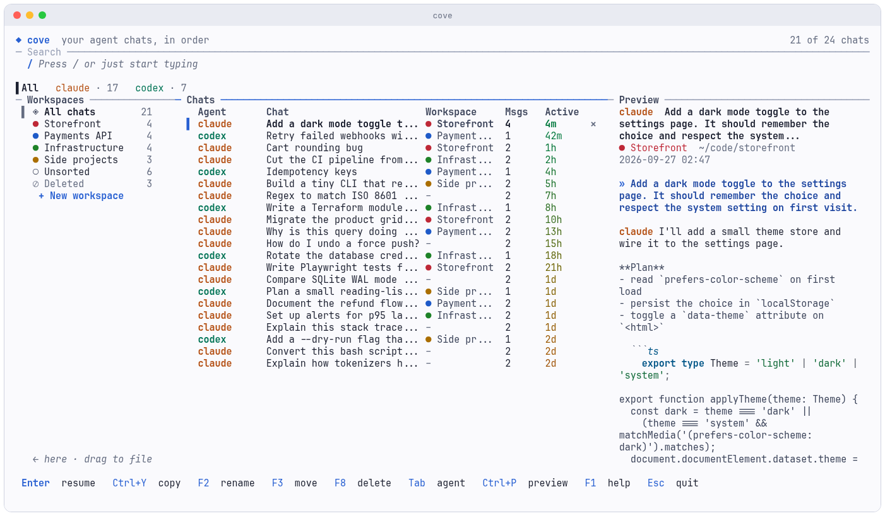

# ◆ cove

**Your coding-agent chats, in order.**

[](https://www.npmjs.com/package/cove-cli)
[](https://github.com/5h3rd1l/cove/actions/workflows/ci.yml)
[](LICENSE)

```bash
npm install --global cove-cli
```

Then run `cove` (or the short form, `cv`).

Cove is a terminal app for everyone who talks to coding agents all day. It finds every chat you have had with Claude Code, Codex, opencode and friends, lets you **group them into workspaces**, **rename them**, and jump straight back into any of them.



```
cove                 open the app
cove "auth bug"      open it with a search already typed
cove --list          print your chats instead of opening the app
```

`cv` is the short form of `cove`: everything above works with `cv` too.

## What you get

- **Workspaces.** One per project. Drag a chat onto a workspace, or press `F3`. Each workspace gets its own color.
- **Names you choose.** Double-click a chat (or press `F2`) and call it what it actually is.
- **Instant search.** Titles, messages and folders, across every agent, with a live preview. Filter with `agent:claude`, `dir:project`, `date:today`.
- **A safe trash.** Delete a chat or a whole workspace and it lands in **Deleted**, where you can browse it and restore it. Erasing for good is a separate, confirmed step.
- **Keyboard or mouse.** `←` `→` move between the workspace list and your chats, `/` jumps to search, and typing anywhere searches.
- **Resume in one key.** `Enter` reopens the chat in its agent, in its folder.

## Screenshots

*Everything on this page uses invented demo chats.*



**Drag a chat onto a workspace** (or press `F3`). Names you choose, like "Cart rounding bug", replace the agent's title.



**Open a workspace** to see just its chats, each project in its own color.



**Deleted things are recoverable.** Open a deleted workspace to look inside without restoring it; `F8` restores, `Delete` erases for good after a confirmation.



**Everything is on `F1`.**



**Light theme** (`cove --theme light`, or automatic from your terminal).



## Your chats are never touched

Cove only *reads* your agents' history. Workspaces, names and the trash live in one small file, `~/.local/state/cove/state.json`. Deleting something in Cove never deletes a chat from Claude, Codex or opencode, and `claude --resume` keeps working for everything.

## Keys

| | |
|---|---|
| `Enter` | resume the chat |
| `/` or just type | search |
| `←` `→` | workspace list / chats |
| `F2` | rename the chat (or the workspace, when the list is focused) |
| `F3` or drag | move the chat to a workspace |
| `F4` | new workspace |
| `F8` or `Delete` | delete (in **Deleted**: `F8` restores, `Delete` erases for good) |
| `Ctrl+O` | hide or show the workspace list |
| `F1` | every shortcut |

## Install

```bash
npm install --global cove-cli
```

That is all: npm picks the right native binary for your machine. It installs two commands, `cove` and `cv`.

> **Platforms:** Linux x64 today. macOS and Linux arm64 builds are on the way; until they are published, use the source install below.

**From source** (any platform, needs Rust 1.88 or newer):

```bash
git clone https://github.com/5h3rd1l/cove.git && cd cove
cargo build --release
ln -sf "$PWD/target/release/cove" ~/.local/bin/cove
ln -sf "$PWD/target/release/cove" ~/.local/bin/cv    # optional short form
```

The first run builds a search index in `~/.cache/cove`.

## Coming from `frw`?

Cove was called `frw` while it was a fork. On first launch it adopts your old workspaces from `~/.local/state/frw/` automatically, so nothing is lost. The old file is left in place.

## Credits

Cove is built on the excellent [fast-resume](https://github.com/angristan/fast-resume) by Stanislas Lange, which provides the session indexing, agent adapters and search engine. See [NOTICE.md](NOTICE.md).
